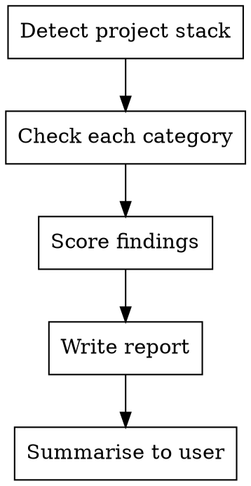

# Codebase Audit

Analyze the current project's codebase against Maverick standard practices and write a findings report to `docs/maverick-audit.md`.

## Preflight (mandatory)

Run this **first**. If it exits non-zero, halt and report the stderr output to the user verbatim. Do not proceed.

```bash
uv run maverick preflight do-maverick-alignment
```

The check verifies the project is initialised and `uv` is on PATH.

## When to Run

- User invokes `/maverick:do-maverick-alignment`
- May also be triggered automatically by the Maverick plugin when no `.maverick/` directory exists in the project root (first session in an uninitialised project)

## Process



### Step 1: Detect project stack

Identify the project type by checking for key files:

- `package.json` -> Node.js (check dependencies for react, fastify, etc.)
- `tsconfig.json` -> TypeScript
- `pyproject.toml` or `requirements.txt` -> Python
- `build.gradle.kts` -> Kotlin
- `Dockerfile` -> Docker

Record the detected stack for the report header.

**Monorepos:** If `workspaces` is defined in `package.json`, or `pnpm-workspace.yaml` / `nx.json` / `turbo.json` exists, treat the root config as the primary audit target. Note per-package gaps in the Details section but do not produce a separate report per package.

### Step 2: Check each category

Run the checks below in order. For each category, determine a status:

- **PASS** -- meets Maverick standards
- **WARN** -- partially meets standards, improvement needed
- **FAIL** -- does not meet standards

Record the evidence (file paths, dependency names, snippets) for each finding.

---

## Audit Coverage

The categories below are the **audit-backed** practice areas — each maps
to a best-practice skill whose hard requirements this audit checks.
The remaining bp skills are **advisory** (applied during implementation
and review, not audited here): mav-bp-operability (beyond
category 11's error-handling check), mav-bp-api-design,
mav-bp-accessibility,
mav-bp-environment-management, and
mav-bp-infrastructure-as-code. Do not report on advisory
areas — absence of an audit category is deliberate, not an oversight.

## Audit Categories

### 1. Linting

**Search for:**

| What              | Where to look                                                                                   |
| ----------------- | ----------------------------------------------------------------------------------------------- |
| ESLint config     | `.eslintrc*`, `eslint.config.*`                                                                 |
| Ruff config       | `[tool.ruff]` in `pyproject.toml`, `ruff.toml`, `.ruff.toml`                                    |
| Other linters     | `.flake8`, `.pylintrc`, `ktlint` in `build.gradle.kts`                                          |
| Linter dependency | `eslint` in `devDependencies`, `ruff`/`flake8`/`pylint` in Python deps                          |
| Lint script       | `"lint"` script in `package.json`, lint commands in `Makefile` or pyproject `[project.scripts]` |

**Scoring:**

| Status | Criteria                                                                                |
| ------ | --------------------------------------------------------------------------------------- |
| PASS   | Linter config exists AND linter is in dependencies AND a lint script/command is defined |
| WARN   | Linter is in dependencies but no config file or no lint script                          |
| FAIL   | No linter found in dependencies or config                                               |

### 2. Unit Tests

**Search for:**

| What        | Where to look                                                                                        |
| ----------- | ---------------------------------------------------------------------------------------------------- |
| Test files  | Glob: `**/*.test.ts`, `**/*.test.tsx`, `**/*.test.js`, `**/*.spec.*`, `**/test_*.py`, `**/*_test.py` |
| Test runner | `vitest`, `jest`, `mocha` in `devDependencies`; `pytest` in pyproject/requirements                   |
| Test script | `"test"` script in `package.json`; `[tool.pytest]` in `pyproject.toml`                               |

**Scoring:**

| Status | Criteria                                                                       |
| ------ | ------------------------------------------------------------------------------ |
| PASS   | Test files exist (3+) AND test runner is configured AND test script is defined AND a coverage threshold is enforced (runner config or CI gate) — the mav-bp-testing 60% unit gate |
| WARN   | Tests exist and run but no coverage gate is enforced, or fewer than 3 test files |
| FAIL   | No test files found                                                            |

**Additional detail:** Count the number of test files found and note their location pattern (co-located with source, or in a separate `tests/` directory).

### 3. Integration Tests

**Search for:**

| What                       | Where to look                                                                                    |
| -------------------------- | ------------------------------------------------------------------------------------------------ |
| Integration directories    | `tests/integration/`, `test/integration/`, `tests/e2e/`, `test/e2e/`, `e2e/`, `__integration__/` |
| Integration files          | `*.integration.test.*`, `*.integration.spec.*`, `*.e2e.test.*`, `*.e2e.spec.*`                   |
| Separation from unit tests | Integration tests in a distinct location from unit tests                                         |

**Scoring:**

| Status | Criteria                                                                |
| ------ | ----------------------------------------------------------------------- |
| PASS   | Dedicated integration or e2e test directory with test files inside      |
| WARN   | Files with integration/e2e in the name exist but no dedicated directory |
| FAIL   | No integration or e2e tests found                                       |

### 4. Documentation

**Search for:**

| What           | Where to look                                                                                |
| -------------- | -------------------------------------------------------------------------------------------- |
| README         | `README.md` at project root                                                                  |
| Docs directory | `docs/` directory with content                                                               |
| README quality | Read the README -- does it have more than 10 lines of meaningful content (not just a title)? |

**Scoring:**

| Status | Criteria                                                                                     |
| ------ | -------------------------------------------------------------------------------------------- |
| PASS   | README.md exists with meaningful content (10+ lines) AND `docs/` directory exists with files |
| WARN   | README.md exists but is minimal (under 10 lines), or no `docs/` directory                    |
| FAIL   | No README.md                                                                                 |

### 5. CI/CD

**Search for:**

| What             | Where to look                                                       |
| ---------------- | ------------------------------------------------------------------- |
| GitHub Actions   | `.github/workflows/*.yml` or `.github/workflows/*.yaml`             |
| Jenkins          | `Jenkinsfile`                                                       |
| Bitbucket        | `bitbucket-pipelines.yml`                                           |
| CircleCI         | `.circleci/config.yml`                                              |
| GitLab           | `.gitlab-ci.yml`                                                    |
| Pipeline content | Read the pipeline config -- does it run linting? Does it run tests? |

**Scoring:**

| Status | Criteria                                                                    |
| ------ | --------------------------------------------------------------------------- |
| PASS   | Pipeline config exists AND it runs both linting and tests                   |
| WARN   | Pipeline config exists but only runs one of linting/tests, or is incomplete |
| FAIL   | No pipeline configuration found                                             |

**Additional detail:** Note which CI/CD platform is used and what steps the pipeline runs.

### 6. Remote Code Review Workflow (Optional CI Gate)

Per mav-bp-remote-code-review, the remote workflow is an **optional** CI-side re-run of the local `agent-code-reviewer`. By default, the local subagent's verdict (run during `do-issue-solo` Phase 9) is the gate the auto-merge path trusts. Some projects opt into the remote workflow for an independent CI check — multi-machine fleets, untrusted dev environments, regulatory audit trails — but its absence is not a compliance failure.

**Search for:**

| What | Where to look |
| --- | --- |
| Marker comment | A line equal to `# maverick:code-review` (after stripping leading whitespace) in any file under `.github/workflows/` |
| PR trigger | `on: pull_request:` block in the same file as the marker |
| Reference action | `anthropics/claude-code-action` reference in the workflow body (informational; not required for compliance — teams may use their own integration) |

**Scoring:**

| Status | Criteria |
| --- | --- |
| PASS | A workflow file under `.github/workflows/` contains the `# maverick:code-review` marker AND has an `on: pull_request:` trigger — the project has opted into the CI-side gate and the wiring looks right |
| WARN | A workflow with the marker exists but is missing the `pull_request` trigger, OR a `pull_request`-triggered workflow exists but no marker (likely a different review pipeline that needs the marker added) — the team's intent is unclear |
| INFO | No workflow under `.github/workflows/` contains the marker — the project is on the local-review default. Note this in the report and move on; do not flag it as a finding |

**Recommendation on WARN:** fix the marker / trigger so the workflow's role is unambiguous. **Recommendation on INFO:** none required. If the team later decides they want the optional CI gate, point them at `mav-bp-remote-code-review` for the manual scaffold steps and the `ANTHROPIC_API_KEY` setup.

### 7. Source Control

**Search for:**

| What | Where to look |
| --- | --- |
| Remote configured | `git remote -v` output |
| .gitignore | `.gitignore` at project root |
| Sensitive files | `.env`, `credentials*`, `*.key`, `*.pem` in tracked files |

**Scoring:**

| Status | Criteria |
| --- | --- |
| PASS | Remote configured AND .gitignore exists AND no sensitive files tracked |
| WARN | Remote configured but .gitignore missing or incomplete |
| FAIL | No remote configured (local-only repository) |

### 8. Application Security

**Search for:**

| What | Where to look |
| --- | --- |
| Security headers | `helmet`, `csp`, `Content-Security-Policy` in code or dependencies |
| Input validation | Validation libraries in dependencies, sanitisation patterns in code |
| Auth middleware | Authentication/authorisation middleware or decorators |
| Secrets scanning | `.github/dependabot.yml`, `.snyk`, `trivy` config, pre-commit hooks |
| SAST/DAST | Security scanning steps in CI pipeline |

**Scoring:**

| Status | Criteria |
| --- | --- |
| PASS | Input validation present AND auth middleware present AND security scanning in CI |
| WARN | Some security measures present but gaps (e.g., no CI scanning, or no input validation) |
| FAIL | No security measures found |

### 9. Dependency Management

**Search for:**

| What | Where to look |
| --- | --- |
| Lock file | `package-lock.json`, `pnpm-lock.yaml`, `yarn.lock`, `uv.lock`, `Cargo.lock`, `go.sum`, `poetry.lock` |
| Automated updates | `.github/dependabot.yml`, `renovate.json`, `.renovaterc*` |
| Vulnerability scanning | `npm audit`, `pip-audit`, `snyk`, `trivy` in CI pipeline |

**Scoring:**

| Status | Criteria |
| --- | --- |
| PASS | Lock file committed AND automated updates configured AND vulnerability scanning in CI |
| WARN | Lock file committed but no automated updates or no vulnerability scanning |
| FAIL | No lock file committed |

### 10. Database Management

**Search for:**

| What | Where to look |
| --- | --- |
| Migration files | `**/migrations/**`, `**/migrate/**`, Prisma/Alembic/Flyway/Knex directories |
| ORM/query builder | prisma, drizzle, knex, sequelize, typeorm, sqlalchemy, diesel, gorm in dependencies |
| Seed data | `**/seed*.*`, `**/fixtures/**` |

**Scoring:**

| Status | Criteria |
| --- | --- |
| PASS | Migration tool configured AND migration files exist AND seed data present |
| WARN | Database dependencies present but no migrations or incomplete migration setup |
| FAIL | Database dependencies present with no migration tooling at all |
| N/A | No database dependencies found |

### 11. Error Handling

**Search for:**

| What | Where to look |
| --- | --- |
| Global error handler | Error middleware, exception filters, error boundaries in code |
| Custom error classes | Classes extending Error/Exception in source |
| Retry logic | Retry/backoff patterns in code or dependencies |

**Scoring:**

| Status | Criteria |
| --- | --- |
| PASS | Global error handler present AND custom error types defined |
| WARN | Some error handling present but inconsistent (e.g., mix of try/catch with no global handler) |
| FAIL | No structured error handling found |

---

## Step 3: Write the report

All scoring in Step 2 is based on the state of the project BEFORE this report is written. Creating the `docs/` directory for the report does not change the Documentation score.

Create `docs/maverick-audit.md` (create the `docs/` directory if it does not exist). Use this exact format:

```markdown
# Maverick Codebase Audit

**Project:** <project-name>
**Date:** <YYYY-MM-DD>
**Stack:** <detected stack, e.g. "Node.js, TypeScript, Vitest">

## Summary

| Category              | Status                | Finding            |
| --------------------- | --------------------- | ------------------ |
| Linting               | <PASS/WARN/FAIL>      | <one-line summary> |
| Unit tests            | <PASS/WARN/FAIL>      | <one-line summary> |
| Integration tests     | <PASS/WARN/FAIL>      | <one-line summary> |
| Documentation         | <PASS/WARN/FAIL>      | <one-line summary> |
| CI/CD                 | <PASS/WARN/FAIL>      | <one-line summary> |
| Source control        | <PASS/WARN/FAIL>      | <one-line summary> |
| Application security  | <PASS/WARN/FAIL>      | <one-line summary> |
| Dependency management | <PASS/WARN/FAIL>      | <one-line summary> |
| Database management   | <PASS/WARN/FAIL/N/A>  | <one-line summary> |
| Error handling        | <PASS/WARN/FAIL>      | <one-line summary> |

**Score: <N>/10 passing** (N/A categories excluded from count)

## Details

### Linting -- <STATUS>

<Evidence: config file paths, dependency names, script definitions>
<If WARN/FAIL: one-line recommendation>

### Unit Tests -- <STATUS>

<Evidence: number of test files, runner, script, file pattern>
<If WARN/FAIL: one-line recommendation>

### Integration Tests -- <STATUS>

<Evidence: directory/file paths found, or absence noted>
<If WARN/FAIL: one-line recommendation>

### Documentation -- <STATUS>

<Evidence: README line count, docs/ contents>
<If WARN/FAIL: one-line recommendation>

### CI/CD -- <STATUS>

<Evidence: platform, config file, steps found>
<If WARN/FAIL: one-line recommendation>

### Remote Code Review Workflow -- <STATUS>

<Evidence: workflow file path containing the `# maverick:code-review` marker, or absence noted>
<If WARN/FAIL: one-line recommendation pointing at the reference template>

### Source Control -- <STATUS>

<Evidence: remote URL, .gitignore presence, sensitive file check>
<If WARN/FAIL: one-line recommendation>

### Application Security -- <STATUS>

<Evidence: security measures found, gaps identified>
<If WARN/FAIL: one-line recommendation>

### Dependency Management -- <STATUS>

<Evidence: lock file, update tool, vulnerability scanning>
<If WARN/FAIL: one-line recommendation>

### Database Management -- <STATUS>

<Evidence: migration tool, migration files, seed data — or N/A if no database>
<If WARN/FAIL: one-line recommendation>

### Error Handling -- <STATUS>

<Evidence: global handler, error types, retry patterns>
<If WARN/FAIL: one-line recommendation>

## Recommendations

<Numbered list of actionable recommendations for WARN and FAIL items only.
Each recommendation should be specific: what to create/change, where, and why.>
```

## Step 4: Summarise to user

After writing the report, print a brief summary:

- The score (e.g. "8/10 passing")
- Which categories are WARN or FAIL
- The path to the full report

## Step 5: Record the milestone

Once the report is written, record that the alignment audit has run on this
project so other skills (and humans running `maverick integration get`) can
see it:

```bash
uv run maverick integration set alignment true
```

This commits the milestone into `.maverick/config.json` — the file is in git
so the state is durable across machines and contributors.

<!-- maverick-plugin-version: 5.0.0 -->
